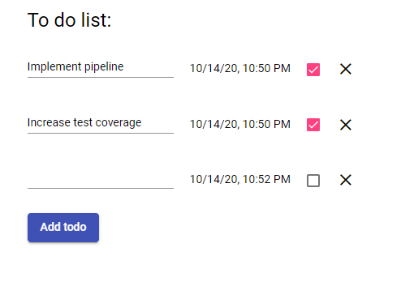

# Todo list
This project was generated with [Angular CLI](https://github.com/angular/angular-cli) version 10.1.6.

## Requirements:
* Nodejs 14.13+
* npm 6.14+

##Installation:
```
npm install
```

## Development server
Run `npm run start` for a dev server. Navigate to `http://localhost:4200/`. The app will automatically reload if you change any of the source files.


